# RockPaperScissors-Game-Motasem
## ✧ Name of the project
### Rock Paper Scissors Game ✌🤚👊 ###

## ✧ Links
- Game Live link: [Here](https://gsg-fc03.github.io/RockPaperScissors-Game-Motasem/)
- Game Repo Link on Github:[Here](https://github.com/GSG-FC03/RockPaperScissors-Game-Motasem.git)
- Figma Design link: [Here](https://www.figma.com/file/v7Cm2TrXPLLbDdWnu9dkmd/Rock-Paper-Scissors-Game-Motasem?node-id=5%3A255)

## ✧The Game
Web Game gives interactive funny journey to play traditional ***Rock Paper Scissors Game ✌🤚👊***, you play 5 rounds against computer.

## ✧ Product Main Features:
* Attractive Colorful
* Includes Sound Effets.
* Desktop First. 

## ✧User Journey
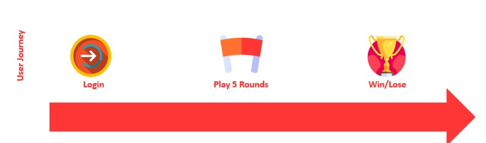 <br>
The User Login to the game and play 5 rounds against computer and the end the result appear.


## ✧User Stories
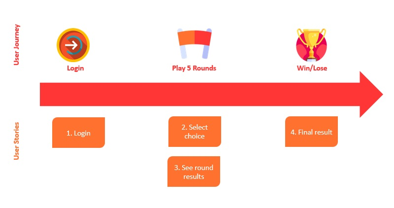 <br>
1- As a `Customer`, I can ***Login using my name*** so that ***I find my saved products in the cart***. <br>

1. As a `Player` I can ***login with my name*** so that ***see it in the game***.
2. As a `Player` I can ***pick choice against computer each round*** so that ***run the round***.
3. As a `Player` I can ***see round results*** so that ***track the competition socre***.
4. As a `Player` I can ***access the final result*** so that ***I know the winner***.
<br>

## ✧The wireframes (User Experiance)
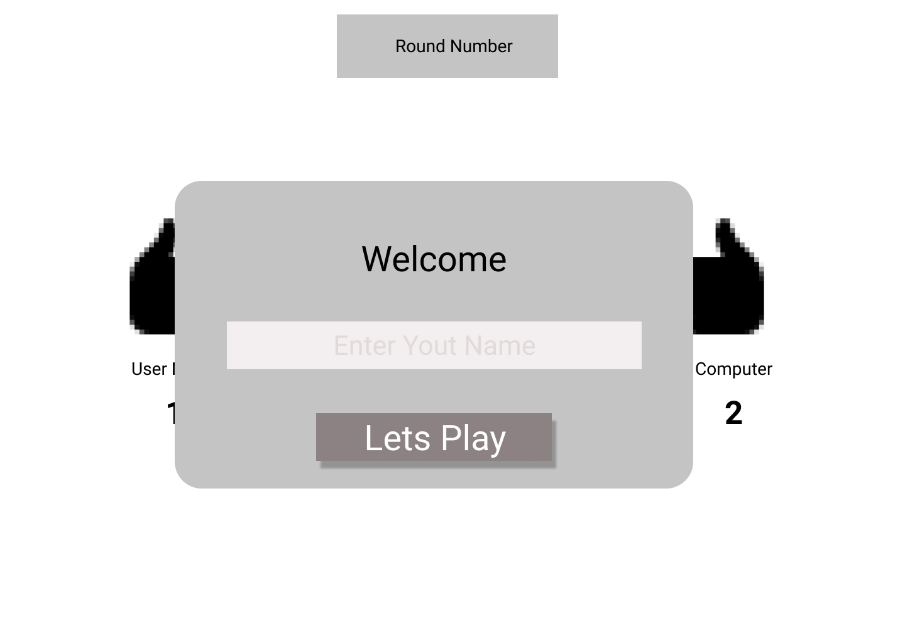
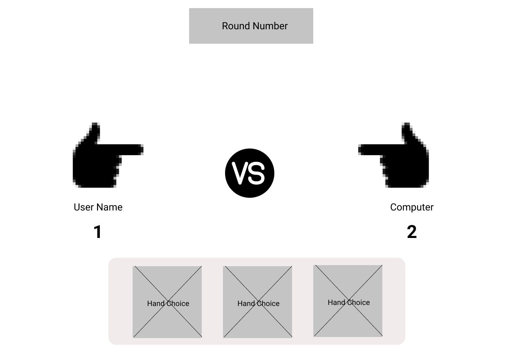
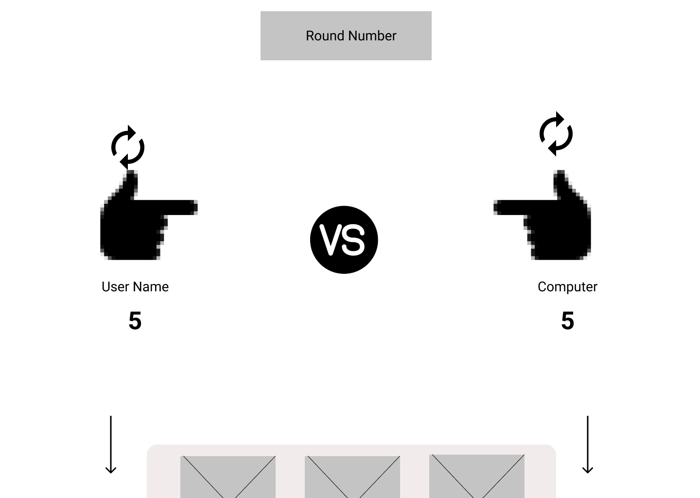
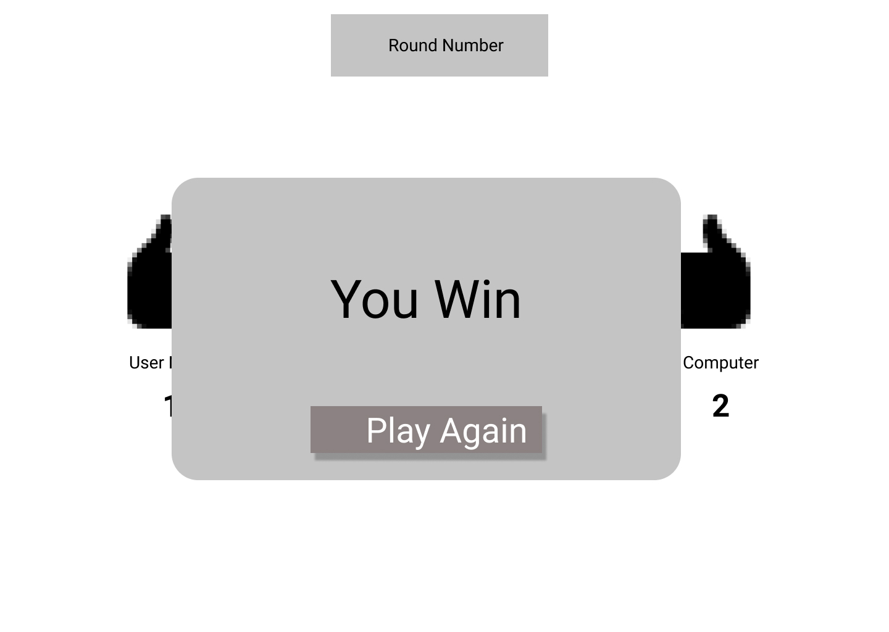
<br>

## ✧The Users Interface (The Final screens)
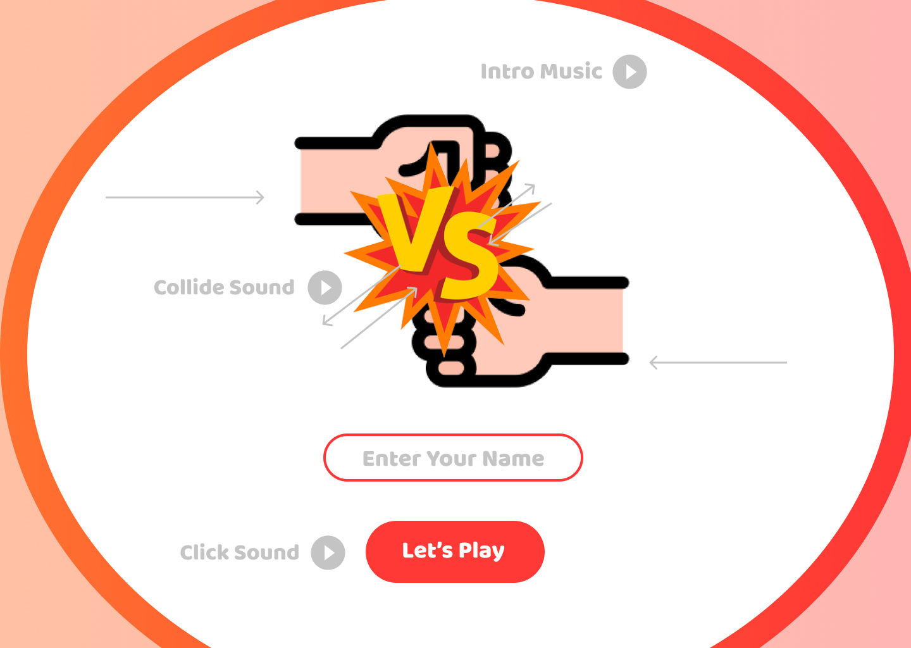
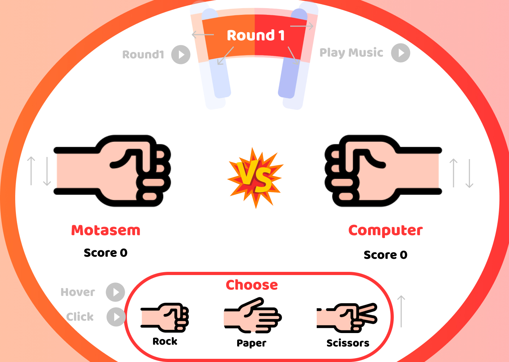
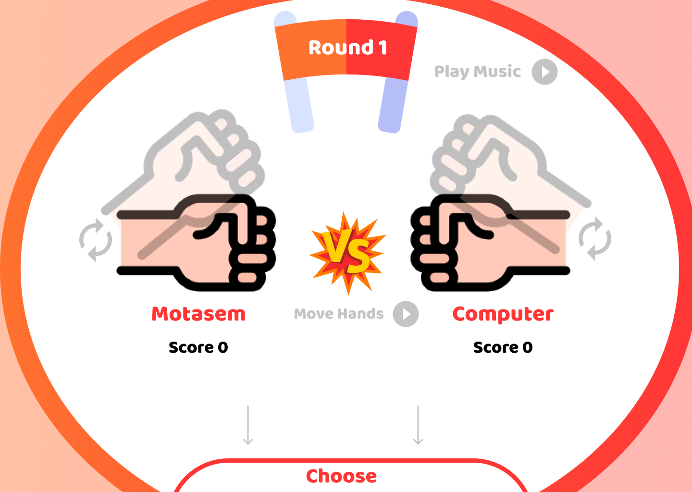
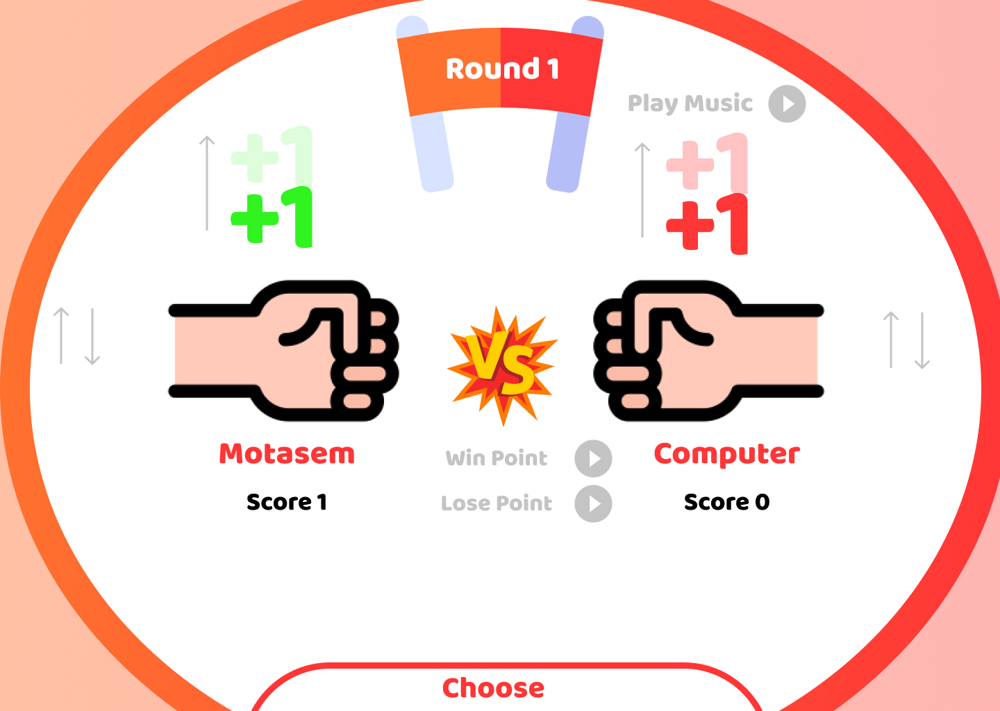
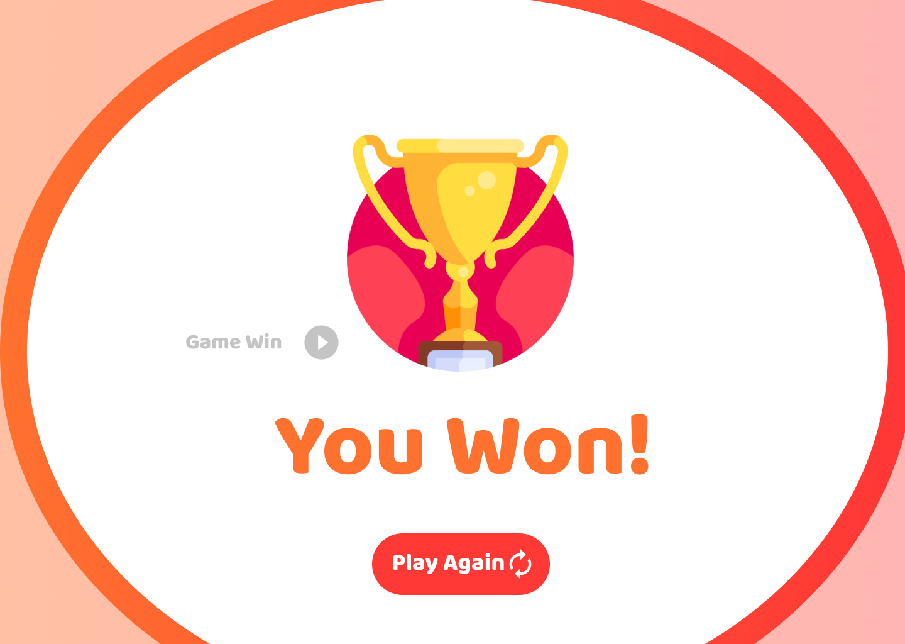
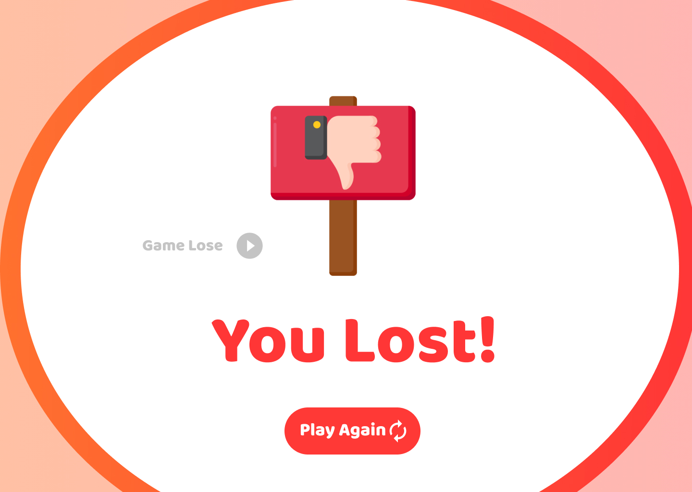
<br>
based on the initial wireframe, I choosed interactive icons and colors to design the game. <br>

## ✧Project Github Management
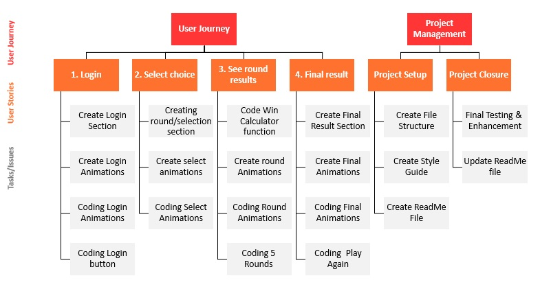 <br>
I subdivided the user stories into smaller tasks to work on.


## ✧How to install the project to run it locally.
on Github terminal/bash

```shell
git clone https://github.com/GSG-FC03/RockPaperScissors-Game-Motasem.git
cd RockPaperScissors-Game-Motasem
go live server
```

## ✧Technology
- HTML ➙ to build the structure of the pages 
- CSS ➙ to style the application and build animations
- JavaScript|DOM Manipulations ➙ To create interaction between the page and the user and track journey.
- API ➙ to import/search products data.
- PPT & GitHub➙ to manage project.

## ✧Game Created by: 
1. [Mutasem Mansour](https://github.com/MMansour87).

## ✧Mentors
All deep thanks for the the valuable efforts of the mentors:
- [Sara](https://github.com/sara219)
- [Lina](https://github.com/lina-jamal)
- [Haneen Shahwan](https://github.com/hshahwan)